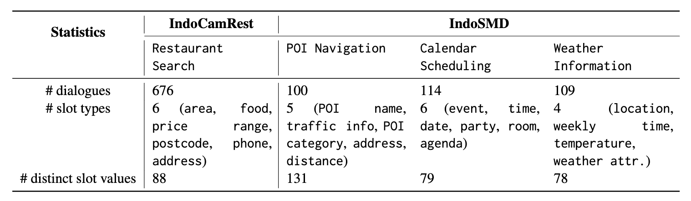
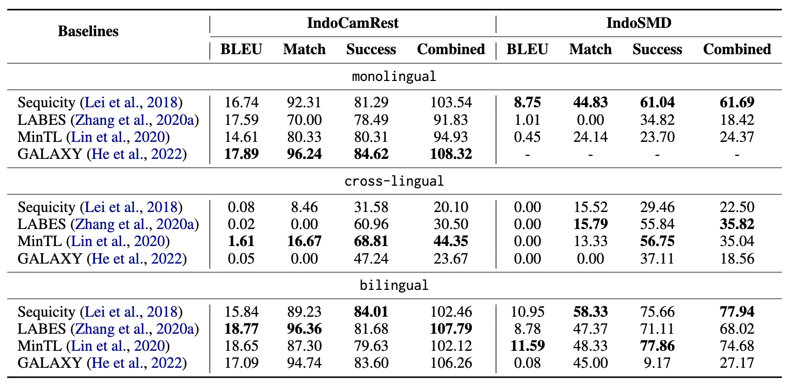

# IndoToD: A Multi-Domain Indonesian Benchmark For End-to-End Task-Oriented Dialogue Systems

This is the dataset repository of <b>IndoToD</b>, presented at SEALP 2023, colocated with AACL 2023, where our paper was awarded with the Best Paper 🏆 [[ACL Anthology]](https://aclanthology.org/2023.sealp-1.7.pdf).

This code has been written using PyTorch. If you use source codes or datasets included in this toolkit in your work, please cite the following paper:
```
@inproceedings{kautsar2023indotod,
  title={IndoToD: A Multi-Domain Indonesian Benchmark For End-to-End Task-Oriented Dialogue Systems},
  author={Kautsar, Muhammad and Nurdini, Rahmah and Cahyawijaya, Samuel and Winata, Genta and Purwarianti, Ayu},
  booktitle={Proceedings of the First Workshop in South East Asian Language Processing},
  pages={85--99},
  year={2023}
}
```

## Summary
We introduce IndoToD, a high-quality multi-domain task-oriented dialogue system data for Indonesian. It comprises two datasets: 
- [IndoCamRest](https://github.com/dehanalkautsar/IndoToD/blob/main/README.md#indocamrest)
- [IndoSMD](https://github.com/dehanalkautsar/IndoToD/blob/main/README.md#indosmd)
  
Overall, it has four different domains by delexicalization to efficiently reduce the size of annotations. To ensure a high-quality data collection, we hire native speakers to manually annotate the dialogues. We annotated the data from existing English ToD datasets: CamRest and SMD. Along with the original English datasets, these new Indonesian datasets serve as an effective benchmark for evaluating Indonesian and English ToD systems as well as exploring the potential benefits of cross-lingual and bilingual transfer learning approaches.




## IndoCamRest

IndoCamRest is a synthetic task-oriented dialogue system dataset that translated from Cambridge Restaurant 676 (CamRest) dataset into the new Indonesian parallel dataset.

## IndoSMD

IndoSMD is a synthetic task-oriented dialogue system dataset that translated from In-Car Assistant (SMD) dataset into the new Indonesian dataset.

## Results



# License
The datasets are under CC-BY-SA 4.0 and the code is license under Apache 2.0.
